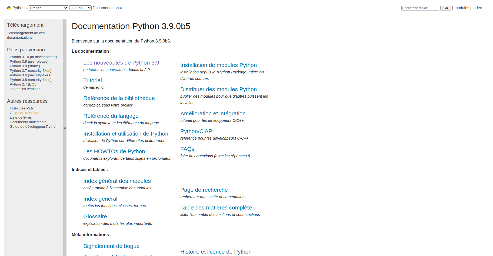
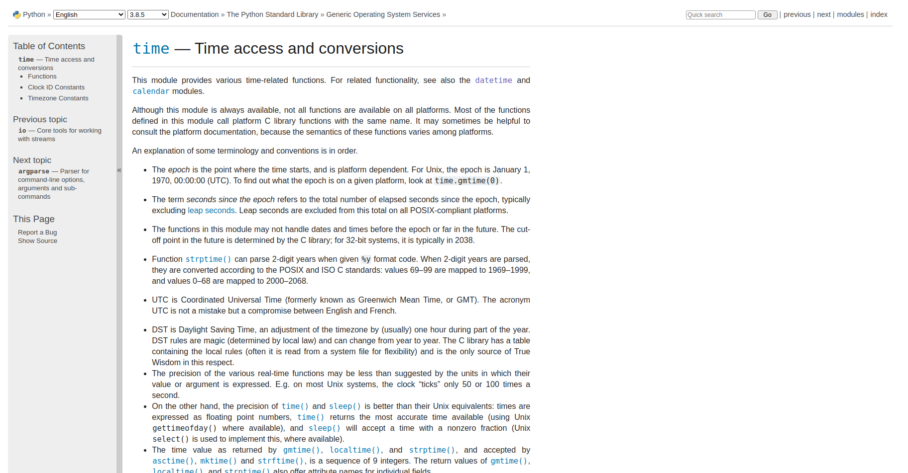
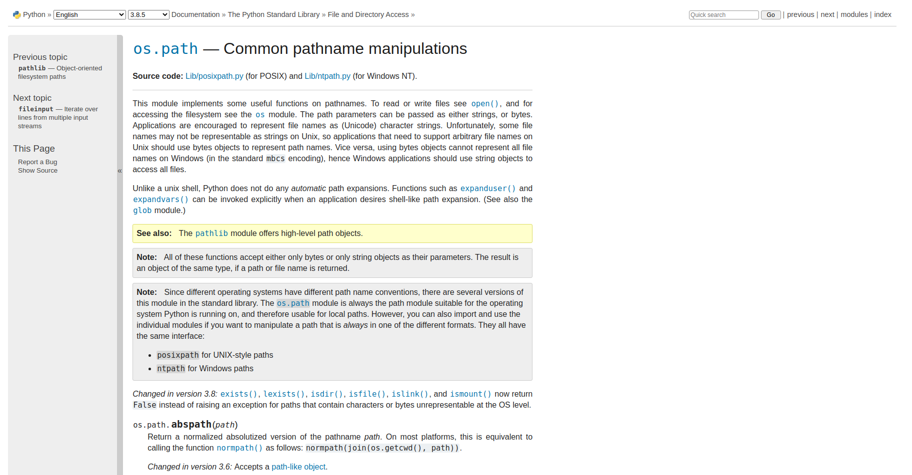
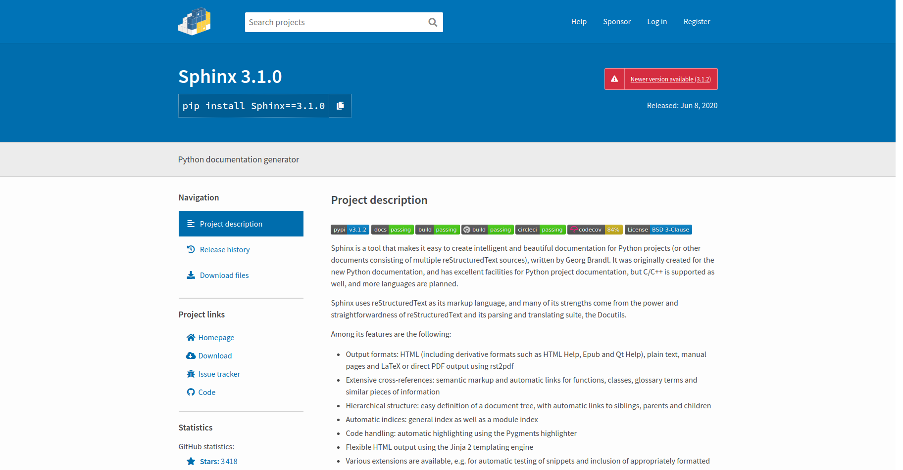
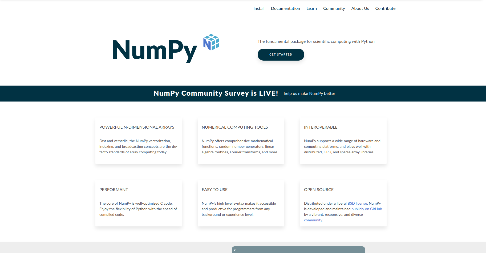
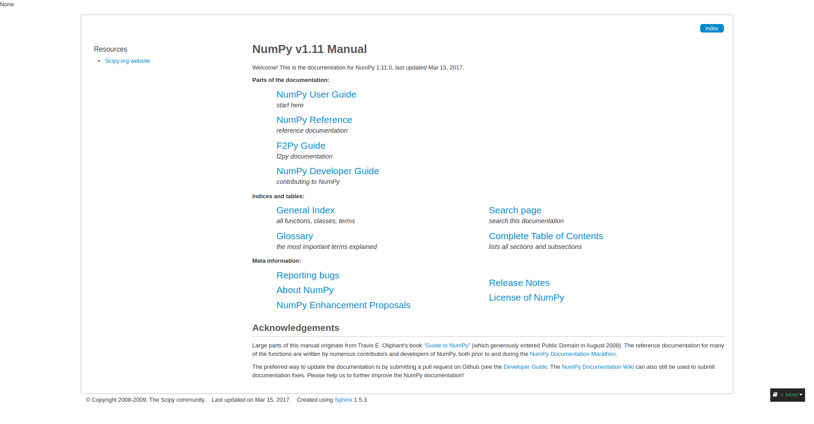
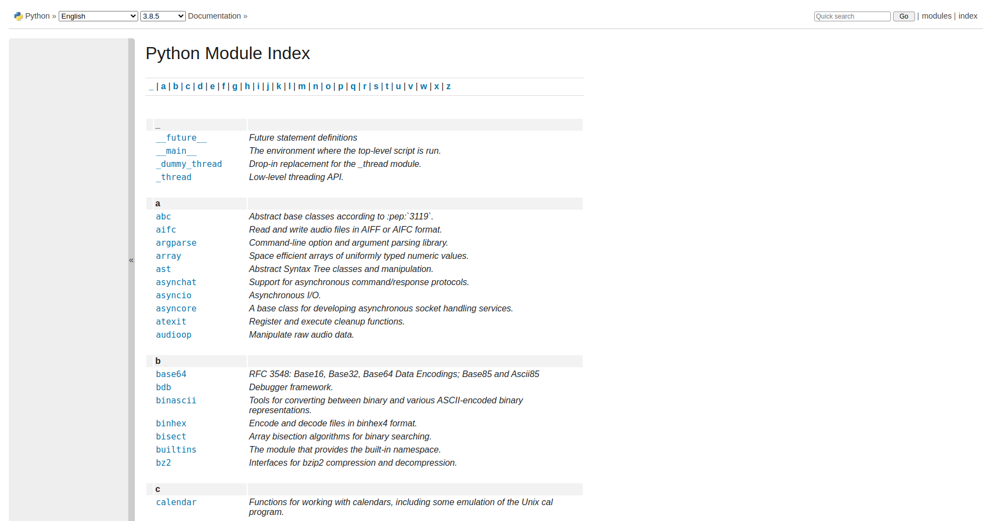
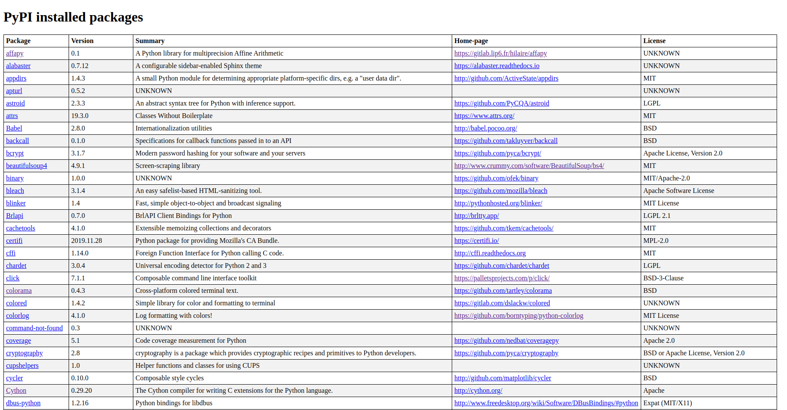

CLI Reference
=============

The command line interface of *pywebdoc* is available for Linux, macOS and Windows.
It uses *click*. To check if you successfully installed the library, you can entry in a command prompt:

.. code-block:: bash

    pywebdoc --help

You will see the following content:

.. code-block:: text

    Usage: pywebdoc [OPTIONS] COMMAND [ARGS]...

    Open Python packages url.

    Options:
    --version      Show the version and exit.
    -v, --verbose  Give more output
    --help         Show this message and exit.

    Commands:
    home           Open the home-page of a PyPI package.
    list-packages  Make HTML file with the list of installed PyPI packages.
    list-std       List standard libraries documentation urls.
    py             Open the Python official documentation.
    pypi           Open the PyPI web page of a package.
    rtd            Open the documentation page of a package on ReadTheDocs.
    std            Open the documentation page of a standard Python library.

It is the help menu of the CLI. You can see all the commands you can use.

Python official documentation
-----------------------------
To **open the Python official documentation**, use the ``py`` command:

.. code-block:: bash

    pywebdoc py [OPTIONS]

You can set the Python version with the VERSION option (default: 3) and the language with the LANG option (default: english).

For example, to open Python 3.9 documentation in french:

.. code-block:: bash

    pywebdoc py -v 3.9 -l fr

This command will open your default web browser on this page:

Standard library
----------------
To **open the documentation page of a standard Python library**, use the ``std`` command:

.. code-block:: bash

    pywebdoc std [OPTIONS] LIBRARY

The LIBRARY argument is the name of the library or module. You can also set the Python version and the language using the same options than the ``py`` command.

For example, to open the documentation of *time*:

.. code-block:: bash

    pywebdoc std time

This is the web page opened:

You can also open modules like *os.path*:

.. code-block:: bash

    pywebdoc std os.path

.. note::
    If the URL does not exist, you see a "**404 Not Found**" error in the command prompt.

PyPI package
------------

*Pywebdoc* can also open URLS about **PyPI packages**.

PyPI web page
~~~~~~~~~~~~~
First, you can **open the PyPI web page of a package** using the ``pypi`` command:

.. code-block:: bash

    pywebdoc pypi [OPTIONS] PACKAGE

The PACKAGE argument is the name of the package.
You can choose the release version with the VERSION option. For example, to open the PyPI web page of *Sphinx* 3.1.0:

.. code-block:: bash

    pywebdoc pypi sphinx -v 3.1.0

This command will open this web page:

Home-page
~~~~~~~~~
You can also **open the home-page of a PyPI package** using the ``home`` command:

.. code-block:: bash

    pywebdoc home [OPTIONS] PACKAGE

.. warning::
    This command will call the ``pip`` command to get the URL of the home-page. So, **the package must be installed**.

For example, to open the home-page of *numpy*, use:

.. code-block:: bash

    pywebdoc home numpy

This command will open this URL:

ReadTheDocs documentation
~~~~~~~~~~~~~~~~~~~~~~~~~
Finally, some PyPI packages host documentation on ReadTheDocs.
To **open the documentation page of a package on ReadTheDocs**, use the command:

.. code-block:: bash

    pywebdoc rtd [OPTIONS] PACKAGE

You can choose the documentation version with the VERSION option (default: latest) and the language with the LANG option (default: en).
For example, you can open the documentation of *numpy* using:

.. code-block:: bash

    pywebdoc rtd numpy

Listing
-------
With *pywebdoc*, you can also see the list of your packages and libraries and their documentation.

* To get the list of **standard Python libraries**, use the ``list-std`` command:

.. code-block:: bash

    pywebdoc list-std [OPTIONS]

You can use the same options as the ``py`` command.
For example, the command

.. code-block:: bash

    pywebdoc list-std

will open this URL:

* To get the list of **installed PyPI packages**, use the ``list-packages`` command:

.. code-block:: bash

    pywebdoc list-packages [OPTIONS]

This command will create a HTML file with the list of installed PyPI packages. The creation of this page may take several minutes.
On this page, you will see the following informations about packages:

- name
- version
- summary
- home-page
- license

Once the file is created, it will be opened immediately. If you need to update the HTML file, use the UPDATE option.

For example, you can see below an example of this file:

